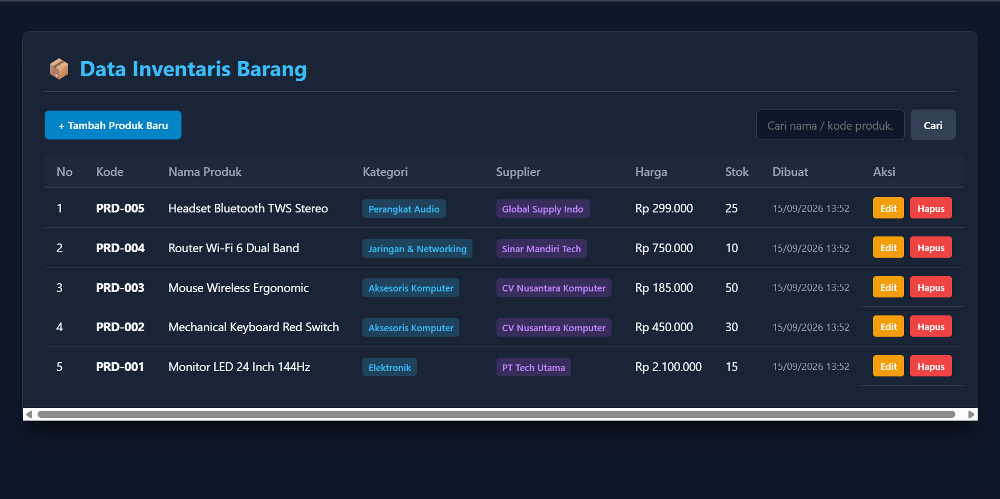
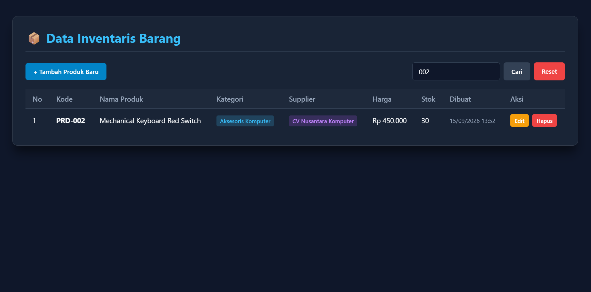
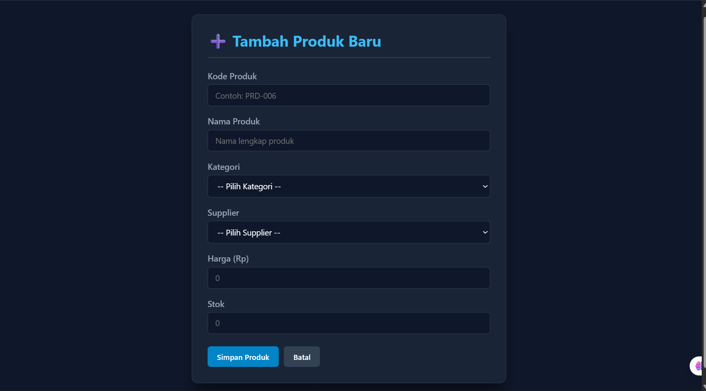
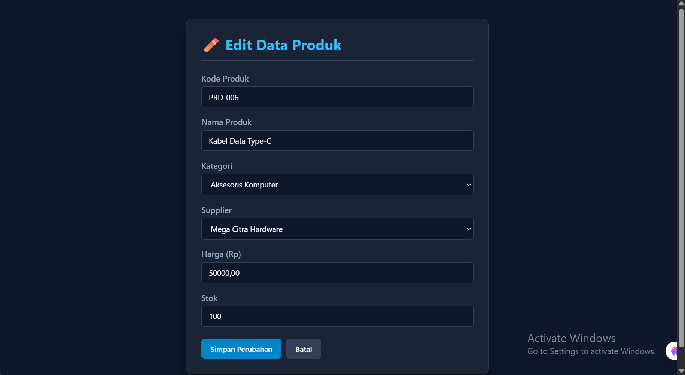
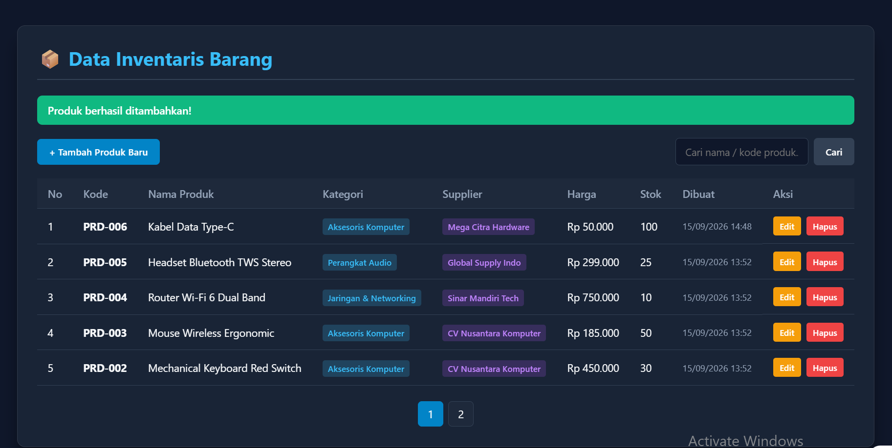
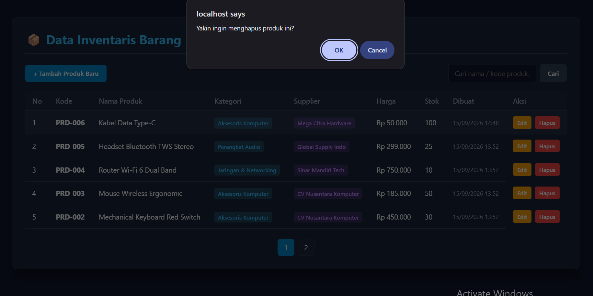
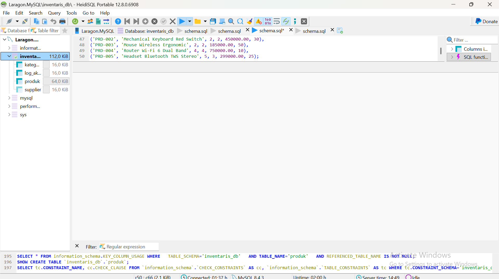

# 📦 Sistem Inventaris Barang — Tugas Rutin 8 (CRUD Inventaris)


Aplikasi web manajemen inventaris barang yang dibangun dengan **PHP Native + PDO (PHP Data Objects)**. Menerapkan **Singleton Pattern** untuk efisiensi koneksi database, arsitektur **Database 3NF** dengan *Foreign Key*, serta keamanan **Prepared Statements** (anti SQL Injection) dan sanitasi **htmlspecialchars()** (anti XSS).

---

## 🔗 Tautan Repositori

- **GitHub Repository:** [TugasWeb-Pertemuan8-CRUD](https://github.com/tengkufahreza6-dev/TugasWeb-Pertemuan8-CRUD)

---

## 👤 Identitas Mahasiswa

| Keterangan | Detail |
| :--- | :--- |
| **Nama** | Tengku Fahreza |
| **NIM** | 4252550005 |
| **Kelas** | PSIK 25B |
| **Program Studi** | S1 Ilmu Komputer |
| **Mata Kuliah** | Pemrograman Web |
| **Instansi** | Universitas Negeri Medan (UNIMED) |

---

## ✨ Fitur Utama

### 🔄 Operasi CRUD Lengkap

- **Read (`index.php`):** Menampilkan daftar produk terurut *latest first* menggunakan `JOIN` 2 tabel (Kategori & Supplier), dilengkapi **pagination** dan **fitur pencarian**.
- **Create (`create.php`):** Form tambah produk dengan **dynamic dropdown** untuk memilih Kategori & Supplier dari database.
- **Update (`edit.php`):** Form edit dengan data *pre-filled* dari database, menggunakan `SELECT` berdasarkan ID.
- **Delete (`delete.php`):** Hapus produk dengan konfirmasi JavaScript + **Database Transaction** untuk mencatat log aktivitas.

### 🔒 Keamanan & Standar Pengodean

- **PDO Singleton Pattern** — Hanya 1 instance koneksi database per request (`Database::getInstance()`).
- **Prepared Statements** — 100% query input memakai `prepare()` + `bindValue()` / `execute([...])`.
- **XSS Protection** — Helper `e()` yang membungkus `htmlspecialchars()` untuk semua output.
- **PRG Pattern (Post-Redirect-Get)** — Mencegah duplikasi submit form saat refresh.
- **PDO Exception Handling** — `try/catch` untuk menangani error database.

### 🎁 Fitur Bonus (Melebihi Requirements)

- ✅ **Transaction pada Delete + Log Aktivitas** — Menggunakan `beginTransaction()`, `commit()`, `rollBack()`, dan mencatat ke tabel `log_aktivitas`.
- ✅ **Fitur Pencarian** — Cari berdasarkan Nama Produk atau Kode Produk.
- ✅ **Pagination** — Navigasi halaman dengan limit 5 data per halaman.
- ✅ **Indikator Stok Kritis** — Visual warning (⚠️ merah) untuk stok ≤ 5 unit.
- ✅ **Flash Message Session-Based** — Notifikasi sukses/gagal dengan redirect.

---

## 📷 Tangkapan Layar Antarmuka

| Halaman Utama (Read Data + Pagination) | Fitur Pencarian Data |
| :---: | :---: |
|  |  |

| Form Tambah Produk (Create) | Form Edit Produk (Update) |
| :---: | :---: |
|  |  |

| Flash Message Sukses | Konfirmasi Hapus Data |
| :---: | :---: |
|  |  |

| Struktur Tabel Database (HeidiSQL) |
| :---: |
|  |

---

## 🗄️ Skema Database (3NF)

Aplikasi ini menggunakan **4 tabel** yang saling terintegrasi:

| No | Nama Tabel | Kolom Utama | Relasi |
| :-: | :--- | :--- | :--- |
| 1 | `kategori` | `id`, `nama_kategori`, `created_at` | — |
| 2 | `supplier` | `id`, `nama_supplier`, `kontak`, `alamat`, `created_at` | — |
| 3 | `produk` | `id`, `kode_produk`, `nama_produk`, `kategori_id`, `supplier_id`, `harga`, `stok`, `created_at` | FK → `kategori.id`, `supplier.id` |
| 4 | `log_aktivitas` | `id`, `aksi`, `keterangan`, `waktu` | Audit log bonus |

### Relasi Foreign Key

```sql
FOREIGN KEY (kategori_id) REFERENCES kategori(id) ON DELETE CASCADE ON UPDATE CASCADE,
FOREIGN KEY (supplier_id) REFERENCES supplier(id) ON DELETE CASCADE ON UPDATE CASCADE
```

---

## 📂 Struktur Direktori Proyek

```text
TugasWeb-Pertemuan8-CRUD/
├── config/
│   └── Database.php              (Singleton Pattern PDO)
├── css/
│   └── style.css                 (Dark Glassmorphism Styling)
├── index.php                     (Read — List Produk + Search + Pagination)
├── create.php                    (Create — Form Tambah Produk)
├── edit.php                      (Update — Form Edit Produk)
├── delete.php                    (Delete — Hapus Produk + Transaction Log)
├── functions.php                 (Helper: Sanitasi `e()` & Flash Message)
├── schema.sql                    (Dump Database + Seeder Data)
├── README.md
└── Screenshot-*.png              (7 Dokumentasi Tangkapan Layar)
```

---

## 🛠️ Teknologi yang Digunakan

| Teknologi | Fungsi |
| :--- | :--- |
| **PHP 8.x (Native)** | Backend logic, routing halaman, session management |
| **PDO (PHP Data Objects)** | Koneksi database dengan prepared statements |
| **MySQL / MariaDB** | Database relasional dengan skema 3NF |
| **HTML5** | Struktur halaman |
| **CSS3 (Dark Glassmorphism)** | Styling UI bertema gelap & modern |
| **JavaScript (Vanilla)** | Konfirmasi hapus produk (`confirm()`) |

---

## ⚙️ Langkah Instalasi & Import Database

### 📋 Prasyarat

- Web Server (**Laragon** / **XAMPP**) dengan PHP 8.x
- Database Server (**MySQL** / **MariaDB**)
- Tools Database (**HeidiSQL** / **phpMyAdmin**)
- Git (opsional)

### 🚀 Langkah-langkah

#### 1️⃣ Clone / Download Repository

**Via Git:**

```bash
git clone https://github.com/tengkufahreza6-dev/TugasWeb-Pertemuan8-CRUD.git
```

**Atau download ZIP** dari GitHub, lalu ekstrak ke direktori web server:

- **Laragon:** `C:\laragon\www\`
- **XAMPP:** `C:\xampp\htdocs\`

#### 2️⃣ Jalankan Web Server & Database Server

- Buka **Laragon** → klik **Start All** (Apache + MySQL)
- Atau via **XAMPP Control Panel** → Start **Apache** dan **MySQL**

#### 3️⃣ Buat Database Baru (`inventaris_db`)

**Via HeidiSQL (Recommended):**

1. Buka aplikasi **HeidiSQL**
2. Klik tombol **New** → isi kredensial koneksi:
   - **Hostname / IP:** `127.0.0.1` (atau `localhost`)
   - **User:** `root`
   - **Password:** *(kosongkan jika default Laragon)*
   - **Port:** `3306`
3. Klik **Save** → **Connect**
4. Klik kanan pada panel kiri → **Create new** → **Database**
5. Nama database: `inventaris_db`
6. Klik **OK** → database baru muncul di sidebar kiri

**Via phpMyAdmin:**

1. Buka `http://localhost/phpmyadmin`
2. Klik tab **Databases** (atau **New** di sidebar kiri)
3. Nama database: `inventaris_db`
4. Collation: `utf8mb4_general_ci`
5. Klik **Create**

#### 4️⃣ Import File `schema.sql`

**Via HeidiSQL (Recommended):**

1. Pilih database `inventaris_db` di panel kiri
2. Menu **File → Run SQL file...**
3. Pilih file `schema.sql` dari folder proyek
4. Klik **Open** → tunggu proses selesai
5. Klik **F5** (Refresh) → pastikan **4 tabel** terbentuk:
   - `kategori` (5 data seed)
   - `supplier` (5 data seed)
   - `produk` (5 data seed)
   - `log_aktivitas` (kosong, akan terisi saat delete)

**Via phpMyAdmin:**

1. Pilih database `inventaris_db`
2. Klik tab **Import** di bagian atas
3. Klik **Choose File** → pilih `schema.sql`
4. Scroll ke bawah → klik **Go**
5. Pastikan 4 tabel muncul di sidebar kiri

**Via Command Line / Terminal (Opsional):**

```bash
cd path/to/TugasWeb-Pertemuan8-CRUD
mysql -u root -p inventaris_db < schema.sql
```

#### 5️⃣ Sesuaikan Konfigurasi Database (Jika Perlu)

Buka file **`config/Database.php`**, sesuaikan kredensial jika berbeda:

```php
private $host = "localhost";
private $user = "root";
private $pass = "";              // Kosongkan jika tanpa password
private $dbname = "inventaris_db";
```

> 💡 **Catatan:** Di Laragon default, user `root` tidak memiliki password. Jika MySQL Anda berpassword, isi di `$pass`.

#### 6️⃣ Jalankan Aplikasi

Buka browser dan akses:

```text
http://localhost/TugasWeb-Pertemuan8-CRUD/
```

**Jika berhasil**, Anda akan melihat:

- ✅ Halaman utama dengan **tabel 5 produk seed**
- ✅ Kategori berwarna biru & Supplier berwarna ungu (badge)
- ✅ Tombol **Edit**, **Hapus**, dan **+ Tambah Produk Baru**
- ✅ Kolom pencarian dan navigasi pagination

---

## 📌 Pemenuhan Requirements Tugas

| No | Requirement | Status | Implementasi |
| :-: | :--- | :---: | :--- |
| 1 | Database `inventaris_db` + 3 tabel + FK | ✅ | 4 tabel dengan FK CASCADE |
| 2 | Minimal 5 data seed per tabel | ✅ | 5 kategori, 5 supplier, 5 produk |
| 3 | Koneksi PDO dengan Singleton pattern | ✅ | `Database::getInstance()` |
| 4 | Halaman list produk dengan JOIN 2 tabel | ✅ | `index.php` — JOIN kategori & supplier |
| 5 | Form create dengan dropdown kategori & supplier | ✅ | `create.php` — dropdown dari DB |
| 6 | Fitur update (pre-filled) & delete (konfirmasi) | ✅ | `edit.php` + `delete.php` |
| 7 | SEMUA query input pakai prepared statements | ✅ | `prepare()` + `execute([...])` |
| 8 | Output HTML pakai `htmlspecialchars()` | ✅ | Helper `e()` di `functions.php` |
| 9 | Flash message sukses/gagal (redirect pattern) | ✅ | PRG Pattern dengan `setFlashMessage()` |
| 10 | UI rapi | ✅ | Dark Glassmorphism CSS |

### 🎁 Bonus (Melebihi Requirements)

- ✅ **Transaction pada delete (log aktivitas)** — `beginTransaction()` + `commit()` + `rollBack()`
- ✅ **Fitur pencarian** — Search by nama & kode produk
- ✅ **Pagination** — Limit 5 data per halaman

---

## 🎯 Nilai Karakter yang Ditunjukkan

| Karakter | Wujud Implementasi |
| :--- | :--- |
| **Ketangguhan** | Debugging error PDO, Foreign Key Constraint, dan *duplicate entry* pada kode produk unik. |
| **Tanggung Jawab** | Menjaga integritas data dengan `FOREIGN KEY ... ON DELETE CASCADE` dan Database Transaction. |
| **Kejujuran** | Kode ditulis sendiri tanpa plagiarisme, dengan referensi dokumentasi resmi PHP. |
| **Ketekunan** | Teliti dalam query prepared statements, sanitasi output, dan validasi input. |

---

## 📜 Lisensi

Proyek ini dibuat untuk keperluan **akademik** (Tugas Rutin 8 — Pemrograman Web, Universitas Negeri Medan). Bebas digunakan sebagai referensi belajar.

---

<p align="center">
  <strong>© 2026 Tengku Fahreza — PSIK 25B — UNIMED</strong>
</p>